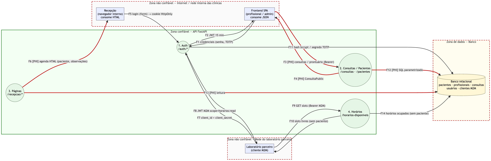
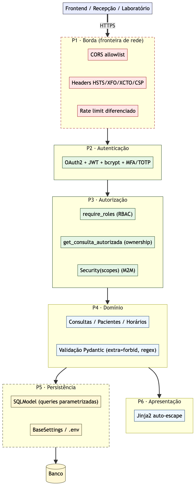

# DR2 AT — API de Agendamento de Consultas

**Aluno:** William Felício Freire
**Disciplina:** Desenvolvimento Seguro de Aplicações Web
**Vídeo (YouTube, não listado):** `<!-- COLAR O LINK DO VÍDEO AQUI -->`

API REST de agendamento de consultas médicas (dado de saúde, LGPD) em FastAPI + SQLModel: OAuth2/JWT com MFA, RBAC + ownership, integração M2M por escopos, correção de vulnerabilidades OWASP, hardening de rede, pipeline DevSecOps e auditoria final.

## Como executar

```bash
cd consultas-api
python3.12 -m venv .venv && source .venv/bin/activate   # Python >= 3.10
pip install -r requirements.txt
source ../scripts/dev_env.sh        # segredos fictícios de DEV (nenhum segredo real é versionado)
uvicorn app.main:app --reload       # ou: ../scripts/servidor.sh start
pytest -v                           # 67 testes, inclui tests/security/
```

- Swagger: <http://localhost:8000/docs> (desligado com `ENV=prod`)
- Páginas da recepção: <http://localhost:8000/recepcao/login>

| Usuário (seed) | Papel        | Observação                                                  |
| -------------- | ------------ | ----------------------------------------------------------- |
| `admin`        | admin        | exige MFA (TOTP): login pela API (`/auth/token` → `/auth/mfa/verify`) |
| `recepcao`     | recepção     | páginas HTML                                                |
| `dra_carla`    | profissional | paciente Ana (id 1)                                         |
| `dr_diego`     | profissional | paciente Bruno (id 2)                                       |
| `lab-parceiro` | M2M          | escopo `horarios:read`                                      |

Senhas de DEV em `scripts/dev_env.sh`.

## Estrutura

```
├── README.md                             ← este documento
├── RELATORIO_TECNICO_DR2_AT.md           ← decisões de segurança por exercício
├── RELATORIO_RASTREABILIDADE_DR2_AT.md   ← capstone: ZAP, matriz T01–T12, code review, risco residual
├── .github/workflows/security.yml        ← pipeline DevSecOps
├── consultas-api/                        ← app/ (auth, core, models, routes, templates) e tests/
├── docs/img/                             ← DFD e partições
├── evidencias/                           ← ex01/ … ex13/ + INDICE.md
└── scripts/                              ← evidencia.sh, servidor.sh, cvss_scores.py, …
```

Cada evidência `.txt` traz no cabeçalho o commit e o comando que a gerou (índice em `evidencias/INDICE.md`). As tags `ex00`…`ex14` marcam o estado de cada exercício; `ex08-vulneravel` marca o código vulnerável de propósito. O Ex. 11 foi feito antes dos Ex. 8–10, para que a SQL injection do Ex. 8 fosse real.

**Princípio transversal:** toda a lógica de segurança (autenticação, autorização, ownership, configuração, headers) vive em `app/auth/` e `app/core/`. As rotas só declaram `Depends`/`Security`; nenhuma reimplementa uma checagem.

---

<a id="ex01"></a>

## Ex. 1 — Fundação

- **venv próprio** (`consultas-api/.venv`, Python 3.12): isola as versões fixadas em `requirements.txt` e torna o build reprodutível, o que também é pré-requisito do SCA (só dá para dizer "esta versão tem CVE" se a versão for conhecida).
- **Módulos:** `main.py` (composição e middlewares), `routes/` (um `APIRouter` por recurso), `models/` (contratos de entrada e saída), `database.py` (persistência), `templates/`, `tests/`.
- **Recurso `consultas`** completo: `POST` 201, `GET` lista, `GET /{id}`, `PATCH`, `DELETE` 204.
- **Teste de sucesso** (`test_criar_e_obter_consulta_sucesso`), preservado até o final.

Evidências: `ex01/01–06` (venv, estrutura, uvicorn, curl das rotas, pytest, Swagger).

<a id="ex02"></a>

## Ex. 2 — Exposição de dados e templates seguros

- **`response_model=ConsultaPublic`** em todas as rotas que devolvem consulta: uma allowlist de saída. Os campos de auditoria (`criado_por`, `ip_origem`, `criado_em`, `atualizado_em`) existem no registro mas não saem na resposta. Entrada (`ConsultaCreate`/`Update`) e saída são modelos separados, nenhum derivado da tabela.
- **Por que é arriscado não definir:** sem `response_model` o FastAPI serializa tudo o que a função retorna. Todo campo interno vaza hoje, e todo campo adicionado amanhã (`cpf`, `senha_hash`) vaza sem nenhuma mudança na rota. O IP de origem junto com autor e horário identifica o paciente: é dado pessoal que, associado a uma consulta, revela dado de saúde (LGPD art. 5º II e art. 11). Classificação: **API3:2023**, A01:2021, CWE-200/213. O teste `test_sem_response_model_vazaria_campos_internos` prova o vazamento num app auxiliar.
- **Jinja2:** herança (`base.html` → `agenda.html`) e auto-escape **explícito** (`select_autoescape(["html"])`). `|safe` em conteúdo de usuário desliga o escape e vira XSS stored. A API JSON devolve `<script>` cru, o que é correto: o encoding depende do contexto de saída, e quem renderiza HTML é que escapa.

Evidências: `ex02/01` (sem `response_model`: vaza) → `ex02/02` (mesmo comando: só campos públicos); `ex02/03–05` (payload XSS exibido como texto, `dialogs=0`).

<a id="ex03"></a>

## Ex. 3 — Tríade CIA, frameworks e DFD

**Confidencialidade pesa mais:** vazamento de dado de saúde é irreversível e comunicável à ANPD (LGPD art. 48), enquanto falhas de integridade ou disponibilidade costumam ser recuperáveis. Por isso, por exemplo, a API responde 404 (não 403) a recurso de terceiro, e BOLA é prioridade crítica mesmo com CVSS médio.

| Pilar | Ameaça concreta                                       | Controle                                                      |
| ----- | ----------------------------------------------------- | ------------------------------------------------------------- |
| C     | vazamento de campos de auditoria / PHI                | `response_model`, minimização na agenda (sem CPF)             |
| C     | XSS stored rouba a sessão da recepção                 | auto-escape, cookie `HttpOnly`, CSP (Ex. 10)                  |
| C     | ler consulta de outro profissional (BOLA)             | JWT + ownership centralizado (Ex. 6/9)                        |
| C     | segredo no código                                     | `BaseSettings` + `.env` (Ex. 11)                              |
| I     | ids inválidos, texto gigante, status arbitrário       | `Field(gt=0)`, `max_length`, enum + transições permitidas     |
| I     | cliente troca `profissional_id` (mass assignment)     | `extra="forbid"`; dono derivado no servidor (Ex. 9)           |
| I     | repúdio (quem alterou?)                               | `criado_por` = usuário autenticado; log central = risco residual |
| A     | flood / força bruta                                   | rate limit (Ex. 10)                                           |

**Frameworks → controles:** OWASP API Top 10 (API1 BOLA → ownership; API2 → OAuth2/bcrypt/MFA; API3 → `response_model`; API4 → `max_length` + rate limit), OWASP Top 10 (A03 → escape e SQL parametrizado; A05 → CORS e headers), NIST SSDF (PO.1/PW.1 → threat model e DFD; PW.7 → revisão + Bandit; PW.8 → `tests/security`; RV.1 → SCA agendado + ZAP), MITRE (CAPEC-63/66/49, ATT&CK T1190/T1110, CWE-79/200).



**Trust boundaries:** TB1 internet ↔ API (toda entrada é não confiável), TB2 laboratório ↔ API (outra organização: um token vazado lá não pode alcançar PHI), TB3 API ↔ banco (onde a injeção se concretiza). Os fluxos com PHI são consultas/prontuário, agenda HTML e banco; o laboratório recebe **só horários livres**.

<a id="ex04"></a>

## Ex. 4 — Misuse cases, STRIDE e threat model

| ID   | Misuse case                                                          | Rota                                   | STRIDE → ameaça |
| ---- | -------------------------------------------------------------------- | -------------------------------------- | --------------- |
| MC01 | profissional troca o id na URL para ler prontuário de terceiro       | `/consultas/{id}`, `/prontuario`, HTML | I, E → T01      |
| MC02 | conteúdo no parâmetro de busca altera a query ao banco               | `GET /pacientes?nome=`                 | T, I → T02      |
| MC03 | markup gravado em `observacoes` executa no navegador da recepção     | `POST /consultas` → páginas HTML       | T, E → T03      |
| MC04 | token vazado do laboratório usado para ler/criar consultas           | `/consultas*`                          | E, I → T07      |
| MC05 | tentativa e erro de senha sem limite                                 | `POST /auth/token`                     | S, D → T05, T10 |
| MC06 | campos extras no corpo sobrescrevem dono/autor da consulta           | `POST`/`PATCH /consultas`              | T, E → T06      |

O STRIDE foi aplicado aos quatro processos do DFD (`/auth/*`, `/consultas/{id}`, `/recepcao/*`, M2M). As ameaças resultantes formam a tabela abaixo, citada pelos testes (`tests/security/test_Txx_*.py`) e pelo relatório de rastreabilidade.

| ID  | Ameaça                                   | STRIDE | Superfície                                                              | Mitigação                                                                          | Teste / evidência                       |
| --- | ---------------------------------------- | ------ | ----------------------------------------------------------------------- | ---------------------------------------------------------------------------------- | --------------------------------------- |
| T01 | BOLA em consulta/prontuário              | I, E   | `/consultas/{id}`, `/prontuario`, detalhe e agenda HTML, `GET /pacientes` | ownership em `get_consulta_autorizada` no prefixo do router; listagens filtradas por `profissional_id` | `test_T01_bola` · `ex09/01,02`, `ex13/08→09` |
| T02 | SQL injection na busca                   | T, I   | `GET /pacientes?nome=`                                                  | query parametrizada + regex no parâmetro                                           | `test_T02_sqli` · `ex09/03`             |
| T03 | XSS stored em `observacoes`              | T, E   | páginas HTML                                                            | auto-escape sem `\|safe` + rejeição de `<`/`>`                                     | `test_T03_xss` · `ex09/04`              |
| T04 | JWT forjado/expirado aceito              | S, T   | toda rota autenticada                                                   | HS256 + `exp`/`iss`/`aud` obrigatórios                                             | `test_T04_jwt` · `ex06/04`              |
| T05 | força bruta de senha                     | S, D   | `/auth/token`, `/recepcao/login`                                        | 5/min nas duas telas de login + erro genérico + MFA no admin                       | `test_T05_bruteforce` · `ex10/02`       |
| T06 | mass assignment                          | T, E   | `POST`/`PATCH /consultas`                                               | `extra="forbid"`; dono vem do paciente, não do corpo                               | `test_T06_mass_assignment` · `ex09/05,06` |
| T07 | token M2M além do escopo                 | E, I   | `/consultas*` com token do laboratório                                  | escopo `horarios:read` + token M2M barrado em rota humana                          | `test_T07_m2m_escopo` · `ex07/04`       |
| T08 | escalada de privilégio / admin sem MFA   | E      | `/admin/*`, `/recepcao/login`                                           | `require_roles` + `require_mfa`; login HTML recusa conta com MFA                   | `test_T08_escalada_privilegio` · `ex06/11–13`, `ex13/08→09` |
| T09 | repúdio                                  | R      | escrita em `/consultas`                                                 | `criado_por`/`atualizado_em`; log central = risco residual                         | parcial                                 |
| T10 | DoS / CORS permissivo                    | D, S   | toda a API                                                              | rate limit global + CORS allowlist                                                 | `test_T10_T12_rede` · `ex10/01,05`      |
| T11 | segredo hardcoded                        | I      | código-fonte                                                            | `BaseSettings` sem default para segredo                                            | `test_T11_segredo` · `ex11/01→02`       |
| T12 | falta de headers de segurança            | T, I   | respostas HTTP                                                          | HSTS, X-Frame-Options, X-Content-Type-Options, CSP                                 | `test_T10_T12_rede` · `ex10/03`         |

<a id="ex05"></a>

## Ex. 5 — Partições e vetores nos três eixos



Cada requisição atravessa as partições em ordem, e cada uma só confia no que a anterior validou: **P1 borda** (CORS, headers, rate limit — `app/core/`) → **P2 autenticação** (JWT, bcrypt, MFA — `app/auth/`) → **P3 autorização** (RBAC, ownership, escopos — `app/auth/dependencies.py`) → **P4 domínio** (rotas + validação Pydantic) → **P5 persistência** (queries parametrizadas, segredos em `BaseSettings`) / **P6 apresentação** (escape por contexto).

| Eixo           | Vetores (ameaça)                                                                          |
| -------------- | ----------------------------------------------------------------------------------------- |
| Design         | ausência de ownership (T01), escopo amplo para o parceiro (T07), admin sem 2º fator (T08), IDs sequenciais |
| Implementação  | SQLi (T02), XSS (T03), mass assignment (T06), validação fraca, JWT mal validado (T04)     |
| Infraestrutura | CORS `*` (T10), falta de headers (T12), segredo no código (T11), sem rate limit (T05/T10) |

**Conclusão para os Ex. 6–7:** P2 atende dois tipos de cliente. Humanos usam senha → JWT curto + RBAC + ownership + MFA no admin. O laboratório é uma máquina → client credentials com um único escopo de leitura e sem papel.

<a id="ex06"></a>

## Ex. 6 — Autenticação e autorização

- **OAuth2 + bcrypt + JWT:** `OAuth2PasswordBearer`; senhas com bcrypt (12 rounds), o seed só guarda hash; JWT HS256 com `sub/iss/aud/iat/exp`, **15 min** (sem revogação stateless, a janela curta limita o dano de um vazamento). Erro de login genérico, para não enumerar usuários.
- **MFA (TOTP simulado):** para o admin, a senha só libera um `mfa_token` (5 min, `scope: mfa_pending`) que não abre nenhuma rota. O access token vem após `/auth/mfa/verify` com o código TOTP, com `mfa: true`. É "simulado" porque o segredo é semeado em vez de provisionado num app autenticador; o algoritmo é o de produção.
- **RBAC + ownership:** RBAC (`require_roles`) decide _o que_ cada papel pode fazer (403). Ownership (`get_consulta_autorizada`) decide _sobre quais objetos_: profissional só acessa consultas dos seus pacientes, e a resposta é **404** para não confirmar que o recurso existe. RBAC sozinho não pega BOLA, porque os dois profissionais têm o mesmo papel. ABAC seria complexidade sem ganho para três papéis e uma regra de posse.
- A regra de posse existe **num único lugar**; as rotas só declaram a dependência.

| Rota                     | recepção    | profissional                   | admin (+MFA) | laboratório |
| ------------------------ | ----------- | ------------------------------ | ------------ | ----------- |
| `GET /consultas`         | todas       | só as suas                     | todas        | ✗           |
| `GET /consultas/{id}`    | ✓           | só as suas                     | ✓            | ✗           |
| `PATCH /consultas/{id}`  | só cancelar | só as suas                     | ✓            | ✗           |
| `DELETE /consultas/{id}` | ✗           | só as suas                     | ✓            | ✗           |
| `POST /consultas`        | ✗           | só para pacientes próprios     | ✓            | ✗           |
| `GET /recepcao/agenda`   | ✓ (cookie)  | só as suas                     | ✓            | ✗           |
| `GET /admin/usuarios`    | ✗           | ✗                              | ✓            | ✗           |

Evidências: `ex06/01–09` e os prints `ex06/10–13` (401 sem sessão, 403 de RBAC, 403 do admin sem MFA, 200 com MFA).

<a id="ex07"></a>

## Ex. 7 — Integração M2M e escopos

**Client credentials** é o único fluxo adequado: o laboratório é uma máquina, sem usuário nem navegador (authorization code e device code pressupõem uma pessoa; password grant para máquina é antipadrão). `POST /auth/client-token`, secret guardado com bcrypt.

| Claim             | Humano (profissional)            | M2M (laboratório) |
| ----------------- | -------------------------------- | ----------------- |
| `papel`           | sim                              | ausente           |
| `scope`           | `consultas:read consultas:write` | `horarios:read`   |
| `client_type`     | —                                | `m2m`             |
| `profissional_id` | sim                              | —                 |
| `exp`             | 15 min                           | 10 min            |

**Garantia técnica mesmo com o token vazado:** (1) o laboratório só recebe `horarios:read`, e `/horarios-disponiveis` devolve só horários livres, sem paciente; (2) `get_current_user` recusa qualquer token `client_type: m2m`, então `/consultas` responde 403. O `client_id` também não faz login humano.

Evidências: `ex07/01–06`.

<a id="ex08"></a>

## Ex. 8 — Vulnerabilidades identificadas lendo o código

Falhas introduzidas de propósito na tag `ex08-vulneravel`, cobrindo cinco categorias OWASP:

| V   | Falha e padrão que denuncia                                                         | OWASP      | Ameaça |
| --- | ----------------------------------------------------------------------------------- | ---------- | ------ |
| V1  | `/prontuario` busca por id sem passar por `get_consulta_autorizada` (BOLA)          | A01 / API1 | T01    |
| V2  | `text(f"... LIKE '%{nome}%'")`: entrada do usuário no texto do SQL                  | A03        | T02    |
| V3  | `\| safe` sobre `observacoes` no template de detalhe (XSS stored)                   | A03        | T03    |
| V4  | `extra="allow"` + `setattr` em loop no PATCH (mass assignment)                      | A08 / API3 | T06    |
| V5  | CORS `*` (a), login sem rate limit (b), respostas sem headers de segurança (c)      | A05 / A07  | T10, T05, T12 |

Evidências "antes" (sobre `ex08-vulneravel`): `ex09/*_antes`, `ex10/*_antes`. A V2 extraía `senha_hash` via `UNION`; a V3 executa `alert()` no print.

<a id="ex09"></a>

## Ex. 9 — Correções de entrada e saída

Mesmo comando antes (`ex08-vulneravel`) e depois (`ex09`):

| V            | Correção                                                                                            | Antes → depois                         |
| ------------ | --------------------------------------------------------------------------------------------------- | -------------------------------------- |
| V1           | `item_router` com `Depends(get_consulta_autorizada)` no **prefixo**: toda rota sob `/consultas/{id}` herda a posse | Diego no prontuário da Carla: 200 → 404 |
| V1 (irmão)   | `/recepcao/consultas/{id}` tinha o mesmo padrão; achado por `grep` e corrigido com a mesma dependência | 200 → 404 (dona: 200)                  |
| V2           | `select(...).where(Paciente.nome.contains(nome))` + regex `^[A-Za-zÀ-ÿ' ]{2,60}$`                   | extração via UNION → 422 / valor literal |
| V3           | sem `\|safe` (quebras de linha por CSS) + `<`/`>` rejeitados na entrada                             | `alert()` executa → 422 / texto        |
| V4           | `extra="forbid"`; `profissional_id`/`criado_por` não são campos de entrada; transições de status por whitelist | aceito → 422 `extra_forbidden`         |

A comparação de posse existe só em `dependencies.py` (`ex09/08`). Evidências: `ex09/01–09`.

<a id="ex10"></a>

## Ex. 10 — Hardening de rede

- **CORS:** allowlist de `CORS_ORIGINS`, métodos e headers explícitos; a aplicação **não sobe** se a lista tiver `*` (com credenciais, wildcard deixaria qualquer site ler respostas autenticadas).
- **Headers** em toda resposta: HSTS (1 ano), `X-Frame-Options: DENY`, `X-Content-Type-Options: nosniff`, `Referrer-Policy: no-referrer`; CSP `script-src 'none'` nas páginas HTML.
- **Rate limit:** 5/min nos logins (`/auth/token`, `/auth/mfa/verify`, `/auth/client-token`, `/recepcao/login`) e 120/min global. O contador é em memória: com várias réplicas precisa de Redis (risco residual).

Evidências: `ex10/01` (preflight de `evil.example`: `*` → bloqueado), `ex10/02` (10× 401 → 429 na 6ª), `ex10/03` (headers ausentes → presentes), `ex10/04–06`.

<a id="ex11"></a>

## Ex. 11 — Persistência segura

- **SQLModel:** tabelas separadas dos schemas de entrada/saída; sessão por `Depends(get_session)`; todo acesso por `select().where()` ou `session.get()`, nunca `text()` com f-string. O log do SQL mostra `WHERE nome = ?` com o valor numa tupla separada (`ex11/04`).
- **Credenciais fora do código:** `BaseSettings` lê do ambiente/`.env`; `JWT_SECRET_KEY`, senhas do seed e secret do laboratório **não têm default**, então a aplicação não sobe sem eles (`ex11/06`). O segredo que existia em `security.py` no Ex. 6 (`ex11/01`) saiu do código (`ex11/02`); só `.env.example` é versionado (`ex11/03`).
- **Feito antes dos Ex. 8–10:** com os dados em memória não haveria SQL para injetar, e a V2 seria encenação.

<a id="ex12"></a>

## Ex. 12 — Pipeline DevSecOps, CVSS e security gate

**Testes rastreáveis:** `tests/security/` tem um arquivo por ameaça (`test_T01_bola.py` … `test_T10_T12_rede.py`), com a ameaça e o misuse case na docstring. O teste de RBAC do Ex. 6 foi expandido em `test_T08_escalada_privilegio.py`.

**Priorização (CVSS 3.1 via `scripts/cvss_scores.py` + impacto de negócio):**

| Falha                 | CVSS     | Impacto de negócio                     | Prioridade        |
| --------------------- | -------- | -------------------------------------- | ----------------- |
| V2 SQLi               | 8.8 High | vaza pacientes e hashes                | 1 – Crítica       |
| T11 segredo no código | 7.4 High | forjar qualquer token                  | 2 – Crítica       |
| **V1 BOLA**           | 6.5 Med. | **prontuário de terceiros (LGPD art. 11)** | **3 – Crítica ↑** |
| V4 mass assignment    | 6.5 Med. | reatribuição de consultas              | 4 – Alta          |
| V5a CORS              | 6.1 Med. | leitura cross-origin autenticada       | 5 – Alta          |
| V5b força bruta       | 5.9 Med. | adivinhação de senha                   | 6 – Alta          |
| V3 XSS                | 5.4 Med. | sessão da recepção                     | 7 – Média         |
| V5c headers           | 4.2 Med. | clickjacking/downgrade                 | 8 – Média         |

A BOLA sobe acima do seu CVSS porque o score não sabe que o `C:H` aqui é dado de saúde de outra pessoa.

| Tipo | Ferramenta         | Quando roda                         | Pegaria                       |
| ---- | ------------------ | ----------------------------------- | ----------------------------- |
| SAST | Bandit             | todo PR e push                      | V2 (B608), segredo (B105)     |
| SCA  | pip-audit          | PR + semanal (CVE surge sem commit) | CVEs de pyjwt/python-multipart (achados e corrigidos) |
| DAST | OWASP ZAP baseline | com a API no ar                     | headers, cookies              |
| IAST | não implementado   | exigiria ambiente instrumentado     | V1 (lógica de negócio)        |

### ⚠️ DECISÃO DO WILLIAM — critério de bloqueio do gate

> **Proposta (a validar e reescrever por você, e explicar no vídeo).** O `security-gate` **bloqueia o merge** se:
>
> - (a) **qualquer teste** falhar (`tests`, inclui `tests/security`);
> - (b) **Bandit** reportar achado de **severidade ≥ MEDIUM em qualquer confiança** (`bandit -r app -ll`);
> - (c) **pip-audit** encontrar **qualquer CVE com correção disponível**;
> - **ZAP (DAST) é advisory:** roda como `continue-on-error` e **não** entra na decisão do `security-gate`. Um alerta **High** é triado a partir do artefato e vira correção priorizada; Medium/Low são ruído esperado num baseline passivo.
>
> **Justificativa amarrada ao histórico deste Assessment:**
>
> 1. **Por que Bandit sem filtro de confiança.** Descobri, medindo, que esta versão do Bandit reporta a nossa SQLi (V2, `B608`) como **severidade Medium mas confiança Low**. Um gate "Medium severidade **e** Medium confiança" (o `-ll -ii` que eu havia proposto no início) **teria deixado passar a V2**, que é a falha mais grave do Assessment (CVSS 8.8). Por isso o gate usa `-ll` (severidade Medium+, qualquer confiança). Evidência: `ex12/05_bandit_contra_ex08.txt` — Bandit no worktree da tag `ex08-vulneravel` acha o B608 e o gate sai com código ≠ 0. No código corrigido (`ex10`+), Bandit acha 0 Medium+ e o gate passa (`ex12/02`).
> 2. **Por que SCA bloqueia qualquer CVE com fix.** Se existe correção, o custo de aplicá-la é baixo e o risco de não aplicá-la é conhecido. Foi o caso de `pyjwt`/`python-multipart`: o SCA apontou, eu atualizei, e o `pip-audit` ficou limpo (`ex12/03`).
> 3. **Por que ZAP é advisory (não bloqueia).** Num baseline passivo de API, os Medium/Low típicos são headers extras (COEP/COOP/CORP, Permissions-Policy) e anti-CSRF — que já temos teste cobrindo (`tests/security/test_T10_T12_rede.py`). Além disso, o alcance de rede do container do ZAP no runner é frágil. Bloquear o merge por isso geraria falso-negativo de produtividade sem ganho de segurança, então o ZAP informa (artefato) e um eventual **High** é triado manualmente. Os bloqueios determinísticos ficam com `tests`, `sast` e `sca`.

**Demonstração no GitHub:** o ruleset `protect-main` só aceita merge por PR com o `security-gate` verde (`ex12/08,09`); a `main` está verde (`ex12/10`). O PR #1 (`demo/gate-bloqueio`) reintroduz a V2 e fica bloqueado com `sast`, `tests` e `security-gate` vermelhos (`ex12/07,11`); o log do Bandit mostra o B608 (`ex12/12`). Duas camadas independentes barram a mesma falha: o SAST e o teste de regressão da T02.

<a id="ex13"></a>

## Ex. 13 — Capstone

- **Mocking** (`tests/test_unitarios_mock.py`): `dependency_overrides` para simular papéis sem JWT, `patch` em `verificar_senha` e no TOTP, relógio controlado para expiração e sessão falsa para testar o ownership sem banco. O teste de sucesso do Ex. 1 continua na suíte.
- **Auditoria da OpenAPI** (`scripts/auditar_openapi.py`, `ex13/04`): Swagger e `openapi.json` desligados em produção; 401/403/404 documentados nos routers; IDs sequenciais ficam como risco residual aceito (o ownership já barra o acesso).
- **OWASP ZAP baseline:** 0 FAIL, 6 WARN (Medium/Low), 61 PASS, nenhum High (`ex13/02`). Cada alerta é interpretado no relatório de rastreabilidade.
- **Regressão:** `scripts/regerar_evidencias_finais.sh` repete os ataques dos Ex. 9–10 contra o código final (`ex13/regressao/regressao.txt`).
- **Code review do estado final:** achou falhas de lógica que nem o ZAP nem os testes do Ex. 9 pegavam, todas do padrão "endpoint irmão": admin contornava o MFA pelo login HTML (CR1), login HTML sem rate limit (CR2), agenda HTML e busca de pacientes sem ownership (CR3, CR4). As quatro foram corrigidas com teste: os mesmos testes falham antes (`ex13/08`) e passam depois (`ex13/09`); suíte com 67 testes (`ex13/10`).

Matriz completa, interpretação do ZAP, achados CR1–CR8, risco residual e decisão de deploy: `RELATORIO_RASTREABILIDADE_DR2_AT.md`.
